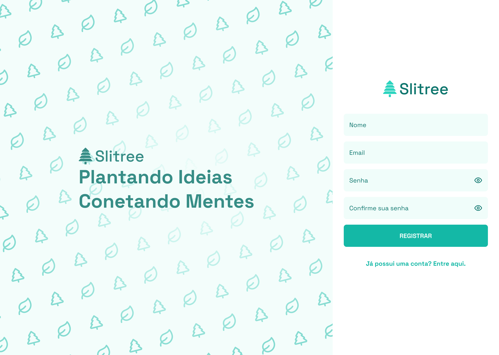
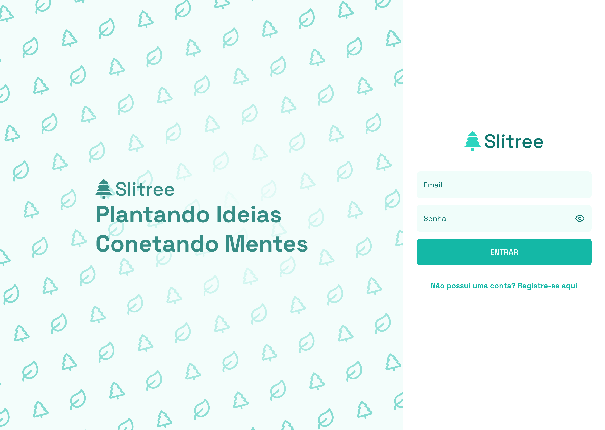
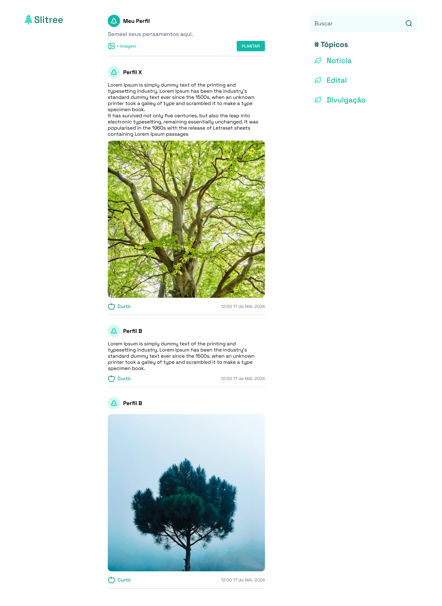

<h1 align="center">
    
</h1>

<h3 align="center">
  Slitree 
</h3>

## ✅ Sobre o projeto

Projeto desenvolvido como desafio proposto pela empresa Jr Loading, consiste em uma rede social aonde as pessoas vão poder fazer suas publicações e outras pessoas vão poder ver e assim curtir.

## 🚀 Tecnologias

<div align="center"> 
  <p align="left"> <a href="https://github.com/hadesfranklyn"> </a> </p>
</div>

## 🛠️ Instalação

### Clone do backend

```bash

$ git clone https://github.com/Pablobrek-bit/Slitree/api
$ cd api
$ npm install
$ docker-compose up -d
$ npx prisma migrate dev
$ npm run dev

```

### Clone do frontend

```bash

$ git clone https://github.com/Pablobrek-bit/Slitree/front
$ cd front
$ npm install
$ npm run dev

```

## 🗃️ Informações adicionais

- [Documentação API](https://app.swaggerhub.com/apis/PabloHenriquedaSilvaAndrade/Slitree/1.0.0)
- [Protótipo Figma](https://www.figma.com/design/3LoeqS3uSbXUR1FreX906C/Slitree?node-id=0-1&t=fsGm0A2S9CufkKJs-1)

## Imagens do projeto

### Register

<h1 align="center">
    
</h1>

### Login

<h1 align="center">
    
</h1>

### Home

<h1 align="center">
    
</h1>
